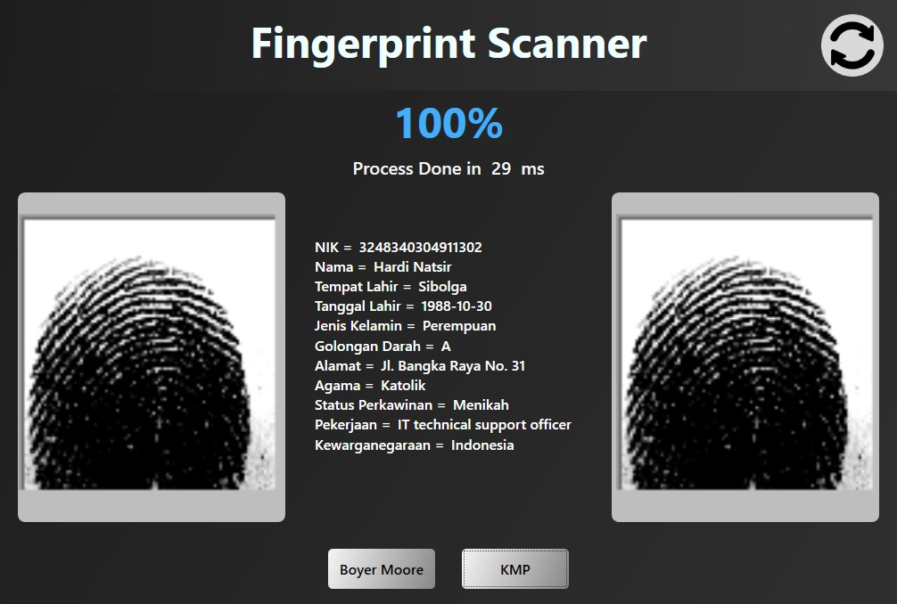
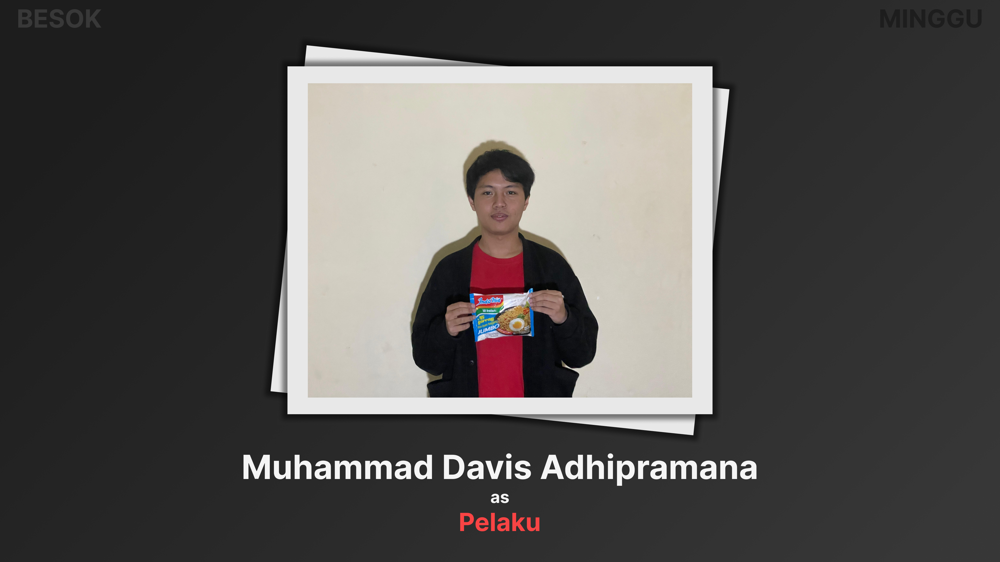
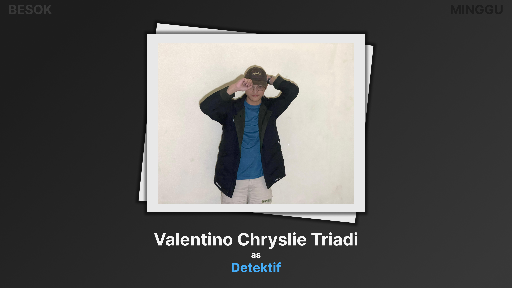

<h1 align="center">IF2211 Strategi Algoritma</h1>

  

 

    Tugas Besar 2: Pemanfaatan Pattern Matching dalam Membangun Sistem Deteksi Individu Berbasis
 Biometrik Melalui Citra Sidik Jari
     
    <a href="https://github.com/ValentinoTriadi/Tubes2_OOP"><strong>Explore the docs »</strong></a>
     
     
    <a href="https://github.com/ValentinoTriadi/Tubes2_OOP">View Demo</a>
    ·
    <a href="https://github.com/ValentinoTriadi/Tubes2_OOP/issues">Report Bug</a>
    ·
    <a href="https://github.com/ValentinoTriadi/Tubes2_OOP/issues">Request Feature</a>
  

## Table of Contents
* [General Info](#about-the-project)
* [Technologies Used](#technologies-used)
* [Features](#features)
* [Screenshots](#screenshots)
* [Setup](#setup)
* [Project Status](#project-status)
* [Acknowledgements](#acknowledgements)
* [Contact](#contact)

## About The Project

This project is a C# Project of Fingerprint Comparison by String matching with a graphical user interface (GUI) created using Wpf, designed to find the matched fingerprint located in database using both KMP and Boyer Moore to get the matched Fingerprints. When not found, we use a String distance algorithm of Levenshtein Distance to calculate similarity and  return the highest similarity as a result. At the end, the app present the biodata, similarity, and the time execution of the searched one

## Technologies Used
- net6.0 - Windows
- WPF

## Features

- [x] Input Fingerprints : Insert a fingerprints photo to find the matched
- [x] Output Image : The image with the highest similarity or the matched one
- [x] Biodata : The data got from the database with the one of the highest similaritry
- [x] Refresh Button : Reseed the database when a new dataset is inserted
- [x] BoyerMoore Button : Do pattern matching using BoyerMoore technique
- [x] KMP Button : Do pattern matching using KMP technique

### Alogrithm Used
- KMP
  Pada Algoritma KMP yang digunakan, akan dikomputasikan terlebih dahulu Border Function-nya. Selanjutnya, untuk tiap image pada dataset yang sudah tertera pada database, akan dilakukan string matching KMP pada tiap imagenya dengan pattern yang ada. Jika match, maka iterasi dihentikan dan hasil akan ditampilkan. Namun jika berbeda, akan dilanjutkan dengan process Levenshtein Distance untuk menghasilkan similarity nya. Jika sampai akhir tidak ditemukan yang match, akan digunakan Similarity yang paling besar untuk penampilan biodatanya. 
- BM
Pada Algoritma Boyer-Moore yang digunakan, akan dikomputasikan terlebih dahulu Last Occurrence Tabelnya. Selanjutnya, untuk tiap image pada dataset yang sudah tertera pada database, akan dilakukan string matching Boyer-Moore pada tiap imagenya dengan pattern yang ada. Jika match, maka iterasi dihentikan dan hasil akan ditampilkan. Namun jika berbeda, akan dilanjutkan dengan process Levenshtein Distance untuk menghasilkan similarity nya. Jika sampai akhir tidak ditemukan yang match, akan digunakan Similarity yang paling besar untuk penampilan biodatanya.
- Reguler Expression
Setelah mendapat kan similarity tertinggi, didapat nama dari pemilik sidik jari nya. Lalu, nama tersebut akan dicocokan dengan pattern REGEX yang didapat dari nama_alay pada tabel Biodata. Pembuatan pattern REGEX dilakukan dengan cara melakukan pembuatan pattern bahasa singkat, dilanjutkan dengan membuat pattern bahasa besar kecil dan diakhiri dengan pembuatan pattern bahasa angka. Pembuatan pattern bahasa singkat dilakukan dengan memasukan semua kemungkinan huruf vokal (a*i*u*e*o*) ke antara 2 huruf non vokal atau angka. Pembuatan pattern bahasa besar kecil adalah dengan membuat semua huruf menjadi bisa huruf besar atau huruf kecil ([aA]). Pembuatan pattern bahasa angka dilakukan dengan mengubah angka menjadi pilihan huruf kecil dan huruf besar, berikut adalah panduan perubahan angka ke huruf  4 → [aA], 1 → [iI], 3 → [eE], 0 → [oO] , 2 → [zZ], 5 → [sS], 6 → [gG].

## Setup
1.  Tambahkan Folder Dataset Terlebih Dahulu pada Directory Tubes3_BesokMinggu
  Buat folder Dataset dan isikan keseluruhan image yang ada disana, Image pada dataset haruslah berbentuk BMP (Penting!!! )
2. Download Dotnet 6.0 Desktop Runtime  
  https://dotnet.microsoft.com/en-us/download/dotnet/thank-you/runtime-desktop-6.0.31-windows-x64-installer?cid=getdotnetcore
3. Source code  
   Lakukan Build Solution pada salah satu IDE (bebas) dapat pada RIDER ataupun Visual Studio
4. Download Executable  
  Jalankan Executable yang terbuat pada directory Tubes3_BesokMinggu/bin/Debug/net6.0-windows/Tubes3_BesokMinggu.exe 
5. Aplikasi Siap Dijalankan

## Project Status
Project is: _completed_

## Acknowledgements
- [Muhammad Fauzan Azhim - 13522153](https://github.com/fauzanazz)

  

- [Muhammad Davis Adhipramana - 13522157](https://github.com/Loxenary)

  

- [Valentino Chryslie Triadi - 13522164](https://github.com/ValentinoTriadi)

  

